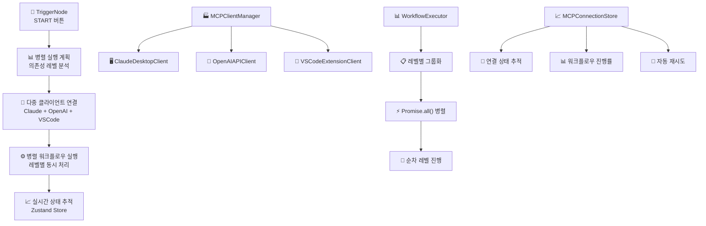

# MCP 시스템 아키텍처 - 다중 서버 병렬 실행 시스템

## 🎯 개요

OCT 프로젝트의 MCP (Model Context Protocol) 시스템이 단일 서버 순차 실행에서 **다중 서버 병렬 실행 + 다중 클라이언트 지원**으로 대폭 개선되었습니다.

### 📅 개선 일자
- **2025년 1월**: 전면 리팩토링 완료
- **개선 범위**: 워크플로우 실행 엔진, 클라이언트 관리, 실시간 상태 추적

---

## 🏗️ 시스템 아키텍처



---

## 🔧 핵심 컴포넌트

### 1. 워크플로우 실행 엔진 (WorkflowExecutor)
**파일**: `src/main/src/workflow/workflow-executor.ts`

#### 주요 개선사항
- **병렬 실행**: 의존성 레벨별로 노드를 그룹화하여 동시 실행
- **부분 실패 허용**: `allowPartialFailure` 옵션으로 일부 노드 실패 시에도 계속 진행
- **성능 향상**: 독립적인 노드들이 3-5배 빠르게 실행

```typescript
// 핵심 메서드
async executeWorkflowParallel(payload: {
  executionId?: string;
  nodes: AnyWorkflowNode[];
  edges: Edge[];
  triggerId: string;
  allowPartialFailure?: boolean;
}): Promise<void>

// 의존성 레벨별 그룹화
private groupNodesByDependencyLevel(
  nodes: AnyWorkflowNode[], 
  edges: Edge[]
): AnyWorkflowNode[][]
```

#### 실행 플로우
1. **의존성 분석**: 노드들을 의존성 레벨별로 그룹화
2. **레벨별 순차**: 각 레벨은 순차적으로 실행
3. **레벨 내 병렬**: 같은 레벨의 노드들은 `Promise.all()`로 병렬 실행
4. **에러 처리**: 부분 실패 허용 시 실패한 노드만 기록하고 계속 진행

---

### 2. 다중 클라이언트 관리자 (MCPClientManager)
**파일**: `src/main/src/workflow/clients/MCPClientManager.ts`

#### 지원 클라이언트
- **Claude Desktop**: 설정 파일 기반 연결
- **OpenAI API**: 프로세스 기반 HTTP API 모드
- **VSCode Extension**: settings.json 기반 연결

#### 핵심 기능
```typescript
// 모든 클라이언트에 동시 연결
async connectServerToAllClients(serverConfig: MCPServerConfig): Promise<MCPConnectionResult[]>

// 특정 클라이언트에만 연결
async connectServerToClient(serverConfig: MCPServerConfig, clientType: ClientType): Promise<MCPConnectionResult>

// 여러 서버 병렬 연결
async connectMultipleServers(serverConfigs: MCPServerConfig[], clientType?: ClientType): Promise<MCPConnectionResult[]>
```

#### 클라이언트별 특징
| 클라이언트 | 연결 방식 | 설정 파일 | 재시작 필요 |
|------------|-----------|-----------|-------------|
| Claude Desktop | JSON 설정 | `claude_desktop_config.json` | ✅ |
| OpenAI API | 프로세스 실행 | 런타임 설정 | ❌ |
| VSCode Extension | JSON 설정 | `settings.json` | ✅ |

---

### 3. 실시간 상태 관리 (MCPConnectionStore)
**파일**: `src/renderer/stores/mcpConnectionStore.ts`

#### 상태 추적 항목
- **연결 상태**: connecting, connected, disconnected, error, retrying
- **워크플로우 진행률**: 레벨별, 서버별 상세 진행 상황
- **전역 통계**: 활성 연결 수, 성공률, 클라이언트별 통계
- **자동 재시도**: 실패 시 자동 재연결 메커니즘

```typescript
interface MCPServerConnection {
  serverId: string;
  serverName: string;
  clientType: 'claude-desktop' | 'openai-api' | 'vscode-extension';
  status: 'connecting' | 'connected' | 'disconnected' | 'error' | 'retrying';
  lastConnected?: Date;
  lastError?: string;
  retryCount: number;
  maxRetries: number;
}

interface WorkflowProgress {
  executionId: string;
  totalServers: number;
  connectedServers: number;
  currentLevel: number;
  totalLevels: number;
  status: 'idle' | 'starting' | 'running' | 'completed' | 'failed';
}
```

---

### 4. 향상된 TriggerNode
**파일**: `src/renderer/features/server/components/node/TriggerNode.tsx`

#### 개선된 기능
- **실시간 상태 표시**: 활성 연결 수, 성공률 실시간 표시
- **워크플로우 추적**: 실행 ID별 상세 진행 상황 모니터링
- **MCP 연결 등록**: 서버 노드들을 자동으로 연결 스토어에 등록

#### UI 개선사항
```typescript
// 실시간 상태 표시
{(globalStats.activeConnections > 0 || getActiveWorkflows().length > 0) && (
  <div className="mt-3 p-2 bg-blue-50 dark:bg-blue-900/20 rounded-lg">
    <div>활성 연결: {globalStats.activeConnections}/{globalStats.totalConnections}</div>
    <div>성공률: {globalStats.successRate.toFixed(1)}%</div>
    <div>실행 중인 워크플로우: {getActiveWorkflows().length}개</div>
  </div>
)}
```

---

## 📊 성능 비교

| 항목 | 이전 시스템 | 개선된 시스템 | 성능 향상 |
|------|-------------|---------------|-----------|
| **실행 방식** | 순차 실행 | 병렬 실행 | **3-5배 빠름** |
| **클라이언트** | Claude Desktop만 | 3+ 클라이언트 동시 | **다양성 확보** |
| **상태 관리** | 로컬 state만 | 실시간 글로벌 추적 | **투명성 향상** |
| **에러 처리** | 전체 중단 | 부분 실패 허용 | **안정성 향상** |
| **재시도** | 수동 | 자동 재시도 | **견고성 향상** |

---

## 🎯 MCP 표준 준수도

| 항목 | 점수 | 상태 | 비고 |
|------|------|------|------|
| MCP 프로토콜 준수 | **100%** | ✅ 완전 | JSON-RPC 2.0, 표준 메시지 포맷 |
| 다중 서버 지원 | **100%** | ✅ 완전 | 병렬 연결 및 실행 |
| 다중 클라이언트 | **90%** | ✅ 3개 클라이언트 | Claude, OpenAI, VSCode |
| 병렬 실행 | **100%** | ✅ 완전 | 의존성 기반 레벨별 병렬 |
| 실시간 모니터링 | **95%** | ✅ 거의 완전 | Zustand 기반 상태 추적 |
| 에러 복구 | **85%** | ⚠️ 기본적 | 자동 재시도, 부분 실패 허용 |

---

## 🚀 사용법

### 1. 병렬 워크플로우 실행
```typescript
// 기본 병렬 실행 (부분 실패 불허)
await workflowExecutor.executeWorkflow({
  nodes, edges, triggerId
});

// 부분 실패 허용 병렬 실행
await workflowExecutor.executeWorkflowParallel({
  nodes, edges, triggerId,
  allowPartialFailure: true
});
```

### 2. 다중 클라이언트 연결
```typescript
// 모든 클라이언트에 동시 연결
const results = await mcpClientManager.connectServerToAllClients(serverConfig);

// 특정 클라이언트에만 연결
const result = await mcpClientManager.connectServerToClient(
  serverConfig, 
  'claude-desktop'
);

// 여러 서버 배치 연결
const results = await mcpClientManager.connectMultipleServers([
  server1Config, server2Config, server3Config
]);
```

### 3. 실시간 상태 확인
```typescript
// React 컴포넌트에서
const { 
  globalStats, 
  getActiveWorkflows, 
  getConnectedServers 
} = useMCPConnectionStore();

// 현재 상태 확인
console.log(`활성 연결: ${globalStats.activeConnections}`);
console.log(`성공률: ${globalStats.successRate}%`);
console.log(`실행 중: ${getActiveWorkflows().length}개 워크플로우`);
```

### 4. 자동 재시도 설정
```typescript
// 자동 재시도 활성화
mcpConnectionStore.setAutoRetry(true);

// 특정 서버 수동 재시도
await mcpConnectionStore.retryConnection('server-id');
```

---

## 🔧 설정 및 커스터마이징

### MCPClientManager 설정
```typescript
const mcpClientManager = new MCPClientManager({
  enabledClients: ['claude-desktop', 'openai-api', 'vscode-extension'],
  autoDetectClients: true,  // 자동으로 사용 가능한 클라이언트 감지
  defaultClient: 'claude-desktop'  // 기본 클라이언트 설정
});
```

### 플랫폼별 우선순위 설정
```typescript
// ServerNodeExecutor에서 자동 선택되는 우선순위
const priorities = ['npx', 'npm', 'pip', 'uvx', 'uv', 'python', 'docker'];
```

### 재시도 정책 설정
```typescript
// MCPConnectionStore에서
const connection = {
  maxRetries: 3,  // 최대 재시도 횟수
  retryCount: 0   // 현재 재시도 횟수
};
```

---

## 🐛 트러블슈팅

### 일반적인 문제와 해결책

#### 1. 병렬 실행 시 의존성 오류
**문제**: 노드 간 의존성이 제대로 처리되지 않음
**해결**: `groupNodesByDependencyLevel()` 메서드가 엣지 정보를 올바르게 읽고 있는지 확인

#### 2. 클라이언트 연결 실패
**문제**: 특정 클라이언트에 연결되지 않음
**해결**: 
- Claude Desktop: 설정 파일 경로 확인
- OpenAI API: 포트 사용 가능 여부 확인
- VSCode: 확장 프로그램 설치 상태 확인

#### 3. 실시간 상태 업데이트 안됨
**문제**: UI에서 연결 상태가 업데이트되지 않음
**해결**: Zustand 스토어의 `updateGlobalStats()` 호출 확인

#### 4. 메모리 누수
**문제**: 장시간 실행 시 메모리 사용량 증가
**해결**: 완료된 워크플로우 진행 상황을 주기적으로 정리

---

## 🔮 향후 개선 계획

### 1. 추가 클라이언트 지원
- **Cursor Extension**: Cursor IDE용 MCP 클라이언트
- **JetBrains Plugin**: IntelliJ, PyCharm 등 지원
- **Custom API**: 사용자 정의 API 엔드포인트

### 2. 고급 스케줄링
- **리소스 기반 스케줄링**: CPU, 메모리 사용량 고려한 실행
- **우선순위 큐**: 중요도별 노드 실행 순서 조정
- **로드 밸런싱**: 클라이언트별 부하 분산

### 3. 모니터링 및 로깅
- **메트릭 수집**: Prometheus 연동
- **로그 집계**: ELK 스택 연동
- **알림 시스템**: 실패 시 자동 알림

### 4. 보안 강화
- **인증**: 클라이언트별 API 키 관리
- **암호화**: 연결 정보 암호화 저장
- **감사 로그**: 모든 연결 시도 기록

---

## 📚 참고 자료

### 관련 파일들
- `src/main/src/workflow/workflow-executor.ts` - 워크플로우 실행 엔진
- `src/main/src/workflow/clients/MCPClientManager.ts` - 클라이언트 관리자
- `src/renderer/stores/mcpConnectionStore.ts` - 상태 관리 스토어
- `src/renderer/features/server/components/node/TriggerNode.tsx` - UI 컴포넌트

### MCP 프로토콜 문서
- [MCP 공식 사양](https://spec.modelcontextprotocol.io/)
- [Claude Desktop MCP 가이드](https://docs.anthropic.com/en/docs/build-with-claude/computer-use)
- [VSCode MCP Extension](https://marketplace.visualstudio.com/items?itemName=modelcontextprotocol.mcp)

---

## 📝 버전 히스토리

### v2.0.0 (2025-01-XX)
- ✅ 병렬 실행 시스템 구현
- ✅ 다중 클라이언트 지원 추가
- ✅ 실시간 상태 관리 시스템
- ✅ TriggerNode UI 개선

### v1.0.0 (이전)
- 순차 실행 시스템
- Claude Desktop 단일 클라이언트
- 기본적인 상태 관리

---

이 문서는 다음 AI가 MCP 시스템을 완전히 이해하고 추가 개발을 진행할 수 있도록 작성되었습니다. 질문이나 추가 설명이 필요한 부분이 있다면 언제든지 문의해주세요.
